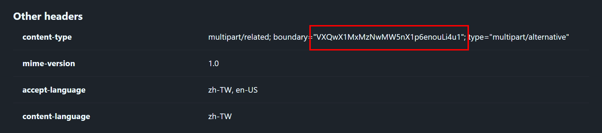
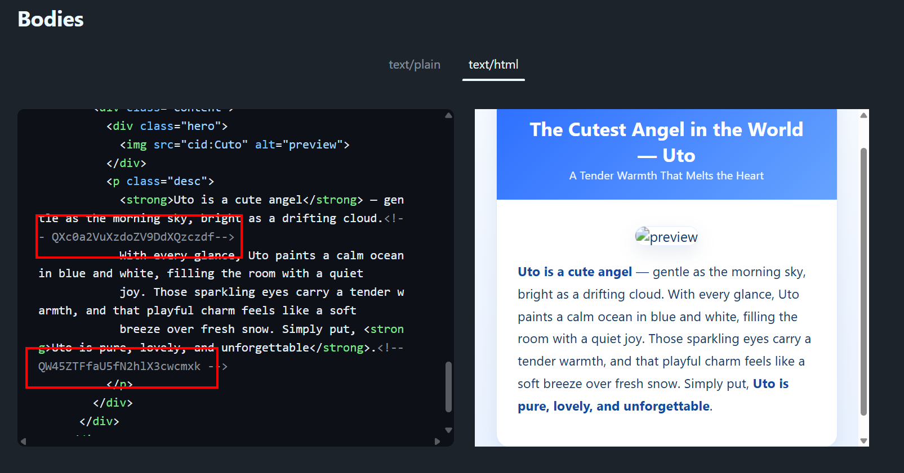
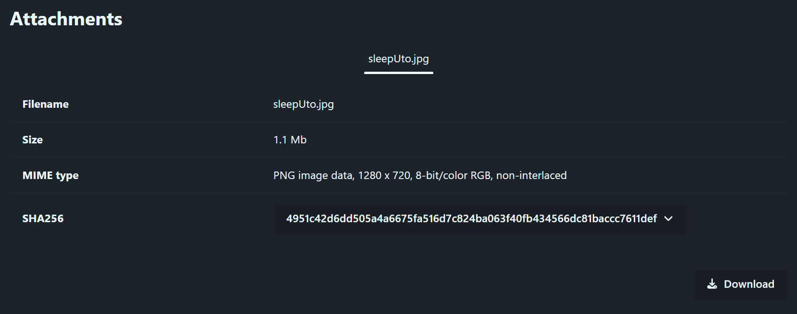

# Sleeping Angel Again

**Category**    : Forensics<br>
**Points**      : 495<br>
**Author**      : 夜有夢

Uto has fallen asleep again. Can you wake her up once more?

**Attachment** :
 - [Uto2.eml](files/dist/Uto2.eml)
<br>
<br>

---

### Reconnaisance

We got another .eml file—`Uto2.eml`—and once again I’m going to use [this website](https://eml-analyzer.herokuapp.com/#/) to help us with the analyzing.

In the content-type header we could find our first base-64 encoded password: `VXQwX1MxMzNwMW5nX1p6enouLi4u1` → `Ut0_S133p1ng_Zzzz....`



Scrolling down to Bodies—text/html—section, we could find another base-64 encoded password:




`QXc0a2VuXzdoZV9DdXQzczdf` → `Aw4ken_7he_Cut3s7_`<br>
`QW45ZTFfaU5fN2hlX3cwcmxk` → `An9e1_iN_7he_w0rld`<br>

Combining them give us our second password: `Aw4ken_7he_Cut3s7_An9e1_iN_7he_w0rld`


Scrolling down more below, we also get an attachment—.png image—named [utoSleep.jpg]() disguised as .jpg file. Download it, and we have our first layer.



### Layer 1 — sleepUto.jpg
<br>

```
└─$ binwalk sleepUto.png

DECIMAL       HEXADECIMAL     DESCRIPTION
--------------------------------------------------------------------------------
0             0x0             PNG image, 1280 x 720, 8-bit/color RGB, non-interlaced
116           0x74            Zlib compressed data, best compression
632289        0x9A5E1         MySQL MISAM index file Version 7
905759        0xDD21F         JPEG image data, JFIF standard 1.01
```

Renaming the file from .jpg to .png doesn’t actually change anything—I’d still throw it into Binwalk either way. Another thing to note: since it’s a .png, Steghide is off the table, meaning we won't be using any of our passwords for now. Running Binwalk shows there’s another embedded .jpeg inside. Extract it with Foremost, and that gives us the second layer.

```
└─$ foremost -t jpeg sleepUto.png
Processing: sleepUto.png
|*|
```

### Layer 2 — wakeUto.jpg
<br>

I named the second image as [wakeUto.jpg](files/wakeUto.jpgwakeUto.jpg) beforehand. This time it’s an actual .jpg, so we can finally throw Steghide at it. 

We also have two possible passwords: `Ut0_S133p1ng_Zzzz....` and `Aw4ken_7he_Cut3s7_An9e1_iN_7he_w0rld`. Now, since the author mentioned in his second hint “*I accidentally added an extra space at the end of a password*,” that means we’ll need to account for it — either by adding the space right away or testing it later on. The tricky part is, the author didn’t say which of the '*layer*' has the password with that extra space, so we’ll have to try both variants.

Long story short, we found the actual password turned out to be `Ut0_S133p1ng_Zzzz....` with the space following it. Use it, and voila, we have our third layer—[flag.enc](files/flag.enc).

```
└─$ steghide extract -sf wakeUto.jpg -p "Ut0_S133p1ng_Zzzz.... "

wrote extracted data to "flag.enc".
```
<br>

### Layer 3 — flag.enc

Here we go the worst part 😮‍💨

Running `file flag.enc` reveals that it's actually an OpenSSL enc'd data, meaning we'll need a password to decrypt it, which is: `Aw4ken_7he_Cut3s7_An9e1_iN_7he_w0rld`

Let's dump the raw data of the file for further analysis.

```
└─$ hexdump -C flag.enc | head -n 20
echo "Bytes: $(wc -c < flag.enc)"

00000000  53 61 6c 74 65 64 5f 5f  3d b9 b0 c3 41 80 b7 17  |Salted__=...A...|
00000010  d6 e0 29 5c 9d 19 d5 08  01 7f 77 a9 28 67 9a 20  |..)\......w.(g. |
00000020  c6 fa fe 46 9e 2d 05 a9  f0 67 18 d3 42 5d 30 02  |...F.-...g..B]0.|
00000030  8d a1 8c 92 ba 55 b0 e8  76 38 58 20 c3 db 3a 5c  |.....U..v8X ..:\|
00000040  99 4d be dc eb 5f ac 90  3d d1 0f ef 01 15 06 15  |.M..._..=.......|
00000050  a0 c2 47 81 5d 11 47 8f  52 01 65 5a 05 a5 f4 1d  |..G.].G.R.eZ....|
00000060  93 0e ff ec d0 69 fd 84  c0 08 43 03 5f b3 25 e1  |.....i....C._.%.|
00000070  69 ba 9e a1 af ff c5 69  60 ab 33 b0 df 34 4d ac  |i......i`.3..4M.|
00000080  bc 4c 5a 92 8e 62 1c 52  f0 29 e4 aa ef 5f 20 fc  |.LZ..b.R.)..._ .|
00000090  a4 63 3e de 4f 16 96 f1  c8 bd ca 98 20 37 96 41  |.c>.O....... 7.A|
000000a0  16 c1 9d 30 59 b4 07 38  71 f7 d7 06 a8 e3 0c aa  |...0Y..8q.......|
000000b0  28 9d 26 82 2b 2f 91 5c  a8 e8 72 3e bd 6d fe d4  |(.&.+/.\..r>.m..|
000000c0  67 71 40 e4 fc c7 81 6a  ae 76 a8 a7 e8 d3 a1 af  |gq@....j.v......|
000000d0  91 f0 5b 3b b8 b2 7a 5f  fc 8e 8c 1e ba a5 7e 19  |..[;..z_......~.|
000000e0  f6 62 99 d8 e5 24 5c bd  fb e2 0a 64 a2 5a 1b 3d  |.b...$\....d.Z.=|
000000f0  a2 86 74 02 73 f0 c2 a3  93 f6 60 8a b6 6f 0b f3  |..t.s.....`..o..|
00000100  21 57 89 44 12 44 02 1d  11 6b 98 94 7e 5e 30 e0  |!W.D.D...k..~^0.|
00000110  c3 2e 9e f0 da 46 58 c0  d7 d0 47 31 36 95 a7 9d  |.....FX...G16...|
00000120  34 3f 26 c9 e3 c7 dd b4  e0 f5 fe c1 7d 63 39 66  |4?&.........}c9f|
00000130  7f 4b 07 26 72 9f 59 03  55 9f 25 e1 b0 5a 6c e8  |.K.&r.Y.U.%..Zl.|
Bytes: 9568

```

Upon first inspection we could see that [flag.enc](files/flag.enc) are 9568 bytes in total, and we know NO FLAG should be that long 😭🙏 — UNLESS, it might be a raw data for another file type (image, audio, etc.) 👀 This idea also aligns with author’s hints: *“Maybe the angel isn’t communicating with you through text*” and “*...Even after you find the flag, it won’t appear in the form you expect. Maybe it’s not meant to be read as text at all.*”

Now let's try to decrypt it, but since there are 140+ OpenSSL cipher/mode combinations to consider, the real question remains: what cipher combination method should we use?

This led me to one idea, well it's bascically just a brutefoce 😃 But the concept is as follow:

1. Decrypt [flag.enc](files/flag.enc) with the password `Aw4ken_7he_Cut3s7_An9e1_iN_7he_w0rld` by trying every supported cipher and flag combination.<br><br>
2. Save all decrypted outputs into `<your-output-directory>`.<br><br>
3. Once all candidates have been generated, scan them with: `strings <your-output-directory>/* | grep -E "PNG|IHDR|IDAT|IEND|RIFF"`<br><br>
4. Finally, only report back to the user the decryption method(s) that produced candidate files containing one of those signatures.

Make a script implementing the idea above. You can download my script [here](files/try_all_method.py). Running the script, gave us what we need to know:

```
└─$ python3 try_all_method.py

Found 143 ciphers. Trying all combinations...
Possible valid decryptions, found patterns in:
- -aes-256-cfb_pbkdf2_md-sha256.bin # found IHDR
- -aes-256-ctr_pbkdf2_md-sha256.bin # found IHDR, IDAT, IEND
- -aes-256-ofb_pbkdf2_md-sha256.bin # found IHDR

```
Voila, the decryption succeeded and it found a PNG chunk data in `-aes-256-ctr_pbkdf2_md-sha256.bin` 👀 Let's hexdump it.

```
└─$ hexdump -C <your-output-directory>/-aes-256-ctr_pbkdf2_md-sha256.bin | head -n 3

00000000  00 00 00 0d 49 48 44 52  00 00 01 5c 00 00 00 63  |....IHDR...\...c|
00000010  08 06 00 00 00 d7 4d b8  e0 00 00 25 1f 49 44 41  |......M....%.IDA|
00000020  54 78 5e ed 5d 09 b8 1c  45 b5 ee f8 dc 97 f7 dc  |Tx^.]...E.......|

```
Just as I thought, the PNG signatures was stripped out. Let's restore it.

```
└─$ ( printf '\x89\x50\x4E\x47\x0D\x0A\x1A\x0A' ; cat decrypt_candidates/-aes-256-ctr_pbkdf2_md-sha256.bin ) > flag.png
```
There you go your [flag](files/flag.png), folk.

😮‍💨