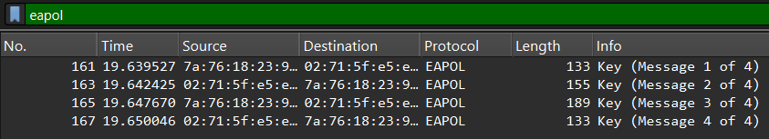

# Forgot Password

**Category**		: Forensic 	
**Points**			: 12
**Author**		: _purposely left empty_

Teman saya lupa passwordnya, yang dia ingat 8 karakter (Uppercase, Number). Tolong bantu pecahkan, terimakasih dan youRock!

Format Flag: `ITTSec{passwordnya}`

### Reconnaissance
We were given a `.cap` file, which I renamed to `.pcap` for easier handling in Wireshark.  
Opening it, the protocol column clearly shows `802.11`, with many packets labeled as `Beacon frame` containing an `SSID`. These are strong indicators that the capture records Wi-Fi traffic. 

Based from the decryption, this challenge idea is Wi-Fi password cracking, and "youRock" clearly hinting us to use RockYou as our wordlist. Before that, let's gather some info.

Running `aircrack-ng <.pcap>` in your terminal will show us some important information:
```
   #  BSSID              ESSID                     Encryption

   1  7A:76:18:23:9F:91  ITTSec                    WPA (1 handshake)
```
It means someone tried to connect to Wi-FI named ITTSec, which has WPA as its encryption method. Password cracking an encryption method WPA is still possible **if** the password is bruteforce-able.

Since it's encryption method is WAP, it must have 4-way handshake. We can check them by applying `eapol` to the Display Filter in Wireshark.



Ensuring the 4-way handshake is complete is essential to determine whether password cracking is possible or not. Fortunately, that is the case for this challenge.

### Password Cracking

Easiest way to bruteforce the password is by using `aircrack-ng`:
```
aircrack-ng <handshake.pcap> -w <wordlist>
```
```
└─$ aircrack-ng handshake.pcap -w ~/TOOLS/WORDLISTs/rockyou

...

                               Aircrack-ng 1.7

      [00:09:29] 11116808/14344389 keys tested (19813.20 k/s)

      Time left: 2 minutes, 42 seconds                          77.50%

                           KEY FOUND! [ GOGETME1 ]


      Master Key     : BE 3F 5A 97 ED 67 B7 03 AF EF B5 DA 88 20 41 94
                       19 98 52 67 97 A9 54 70 07 25 6E 40 A1 DA 46 B9

      Transient Key  : D0 49 B0 FB 0D 16 28 00 00 00 00 00 00 00 00 00
                       00 00 00 00 00 00 00 00 00 00 00 00 00 00 00 00
                       00 00 00 00 00 00 00 00 00 00 00 00 00 00 00 00
                       00 00 00 00 00 00 00 00 00 00 00 00 00 00 00 00

      EAPOL HMAC     : 82 73 26 24 C7 C2 94 EE 4E C7 A6 EA 9A 09 46 48

```

But during the competition, I was using [cap2hashcat](https://hashcat.net/cap2hashcat/) instead.
1. Upload the `.pcap` file
2. Download the result.
3. Run this following command:

	```
	hashcat -m 22000 -a 0 <downloaded-result> <wordlist>
	```


	```
	Dictionary cache built:
	* Filename..: /home/sevgillim/TOOLS/WORDLISTs/rockyou
	* Passwords.: 14344389
	* Bytes.....: 139921314
	* Keyspace..: 14344382
	* Runtime...: 2 secs
	  
	82732624c7c294ee4ec7a6ea9a094648:7a7618239f91:02715fe5ed5e:ITTSec:GOGETME1
	```